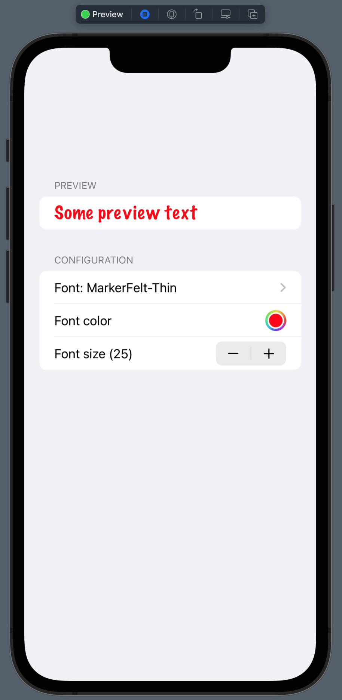

# FontDesigner

A small SwiftUI view to pick a `UIFont`, add a font color and a font size to it and see the preview live.

Here is a preview of the view:

I used this font picker in my [Workout Map](https://github.com/andre0707/WorkoutMap) app.
